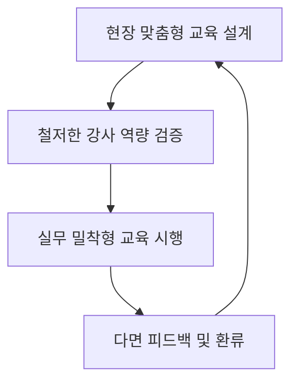
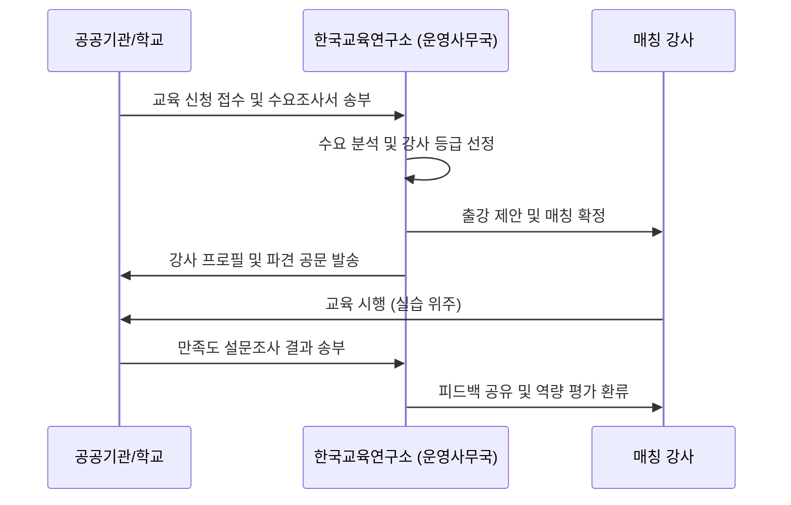

# KERI 공공부문 AI활용교육 강사단 운영계획

본 운영계획서는 한국교육연구소(KERI)의 사회공헌 및 공공 교육 혁신 사업의 일환으로 구성된 'AI활용교육 강사단'의 체계적 관리와 고품질 교육 서비스 제공을 위한 운영 규정 및 실행 매뉴얼입니다.

---

## 1. 운영 목적 및 추진 방향

### 1.1 목적
* 공공 부문(교직원, 공무원, 준공무원 및 공공기관 임직원)의 디지털 전환(DX) 및 행정 효율성 극대화 지원
* 공공 행정 및 교육 현장의 실제 당면 과제를 해결하는 실무 중심의 인공지능(AI) 역량 강화
* 철저한 품질 관리 및 전문 강사진 육성을 통한 지속 가능하고 신뢰성 높은 교육 브랜드 구축

### 1.2 추진 방향

* **현장 밀착형**: 교육 기관의 특성(교육청, 지자체, 공립학교, 공기업 등)에 최적화된 맞춤형 커리큘럼 매칭
* **검증된 강사진**: 교수 역량, 실무 활용 역량, 공공 부문 이해도를 종합 검증한 강사 풀 운영
* **지속적 환류**: 교육 만족도 평가 결과를 강사 보수 교육 및 커리큘럼 고도화에 즉각 반영

---

## 2. 강사단 선발 및 역량 관리 체계

### 2.1 자격 기준 (Qualification Matrix)
강사진은 다음의 세 가지 핵심 역량 기준을 충족해야 합니다.
1. **기술 역량 (Technological competency)**
   * 생성형 AI 툴(Chat GPT, Claude, Copilot 등) 및 노코드 툴에 대한 기술적 이해와 프롬프트 엔지니어링 수행 능력
2. **강의 역량 (Pedagogical competency)**
   * 성인 학습자(공무원 및 교직원) 대상 강의 및 실습 퍼실리테이션 경력 (최소 3년 또는 100시간 이상)
3. **공공 이해도 (Public Sector Understanding)**
   * 공문서 서식 작성 규칙, 개인정보보호법, 공무원 보안 규정 등 공공 행정 지식 보유

### 2.2 강사 등급 기준 및 배치 기준
강사단의 품질 관리를 위해 역량에 따라 등급을 분류하여 배치합니다.

| 등급 | 자격 조건 | 배치 가능한 교육 |
| :--- | :--- | :--- |
| **수석 강사 (Chief)** | 관련 분야 경력 7년 이상 또는 대형 공공기관/교육청 강의 50회 이상 | 기관 단위 종합 컨설팅, 고위직/관리자 대상 특강, 심화 프로젝트 과정 |
| **책임 강사 (Senior)** | 관련 분야 경력 3년 이상 또는 공공기관 강의 20회 이상 | 실무자 대상 행정 자동화 워크숍, 중급 실습 과정 |
| **일반 강사 (Associate)** | 강사단 기본 교육 수료자 및 보조 강사 참여 5회 이상 | 기본 프롬프트 실습 과정, 1:1 밀착 실습 보조 및 튜터 |

---

## 3. 교육 파견 및 매칭 프로세스

강사 파견 프로세스는 수신 기관과의 원활한 행정 협조 및 맞춤형 매칭을 위해 아래 단계로 진행됩니다.

1. **교육 신청 접수**: 기관으로부터 공문 또는 신청서 접수 (교육 인원, 타겟, 실습 환경 확인)
2. **수요 분석 및 매칭**: 교육 목적에 맞춰 수석/책임 강사 후보군을 3배수 선발하여 프로필 검토
3. **매칭 확정 및 공조**: 최종 매칭된 강사의 이력 및 강의 계획을 수신 기관에 공식 공문으로 발송
4. **교육 실시**: 교재 배포 및 실습 환경 세팅 확인 후 강사 파견 진행
5. **사후 관리 및 평가**: 교육 종료 후 설문조사를 수집하여 결과 보고 및 피드백 환류

---

## 4. 교육 품질 관리 및 환류(Feedback) 체계

### 4.1 만족도 조사 기준
* 교육 종료 직후 교육생 전원을 대상으로 모바일 또는 지면 설문조사를 실시합니다.
* 평가지표: 강의 만족도, 실무 유용성, 강사 전문성, 교육 환경 편의성 (5점 척도 평가)
* **목표 점수**: 전체 만족도 평균 **4.3 / 5.0** 이상 유지

### 4.2 품질 미달 강사 조치 기준 (Three-Strike Rule)
* 만족도 평가 결과 3.8 미만인 강사는 즉시 **'밀착 모니터링 대상'**으로 분류됩니다.
* 2회 연속 3.8 미만 시 수석 강사의 1:1 보수 교육 및 코칭 의무 이수
* 3회 연속 미달 시 강사 풀(Pool)에서 배치가 배제되며 재평가를 통과해야 복귀할 수 있습니다.

### 4.3 우수 강사 인센티브
* 분기별 만족도 평균 4.8 이상을 기록한 우수 강사는 차기 대규모 공공 프로젝트의 수석 강사로 우선 매칭되며, 강사료 우대 및 감사패가 지급됩니다.

---

## 5. 행정 서식 안내

각 단계별 필요한 문서 서식은 다음 경로에 배치되어 있습니다.
* **대외 공식 제안문**: [official_letters/기관별_제안문_템플릿.md](file:///c:/Users/금오4/Documents/AI현장강사파견/KERI_AI_PUBLIC_SECTOR_TRAINING/official_letters/기관별_제안문_템플릿.md)
* **강사단 등록카드 양식**: [instructor_pool/강사단_등록카드_양식.md](file:///c:/Users/금오4/Documents/AI현장강사파견/KERI_AI_PUBLIC_SECTOR_TRAINING/instructor_pool/강사단_등록카드_양식.md)
* **교육 과정 세부 계획**: [projects/](file:///c:/Users/금오4/Documents/AI현장강사파견/KERI_AI_PUBLIC_SECTOR_TRAINING/projects) 디렉터리 내 대상별 연수 기획서
