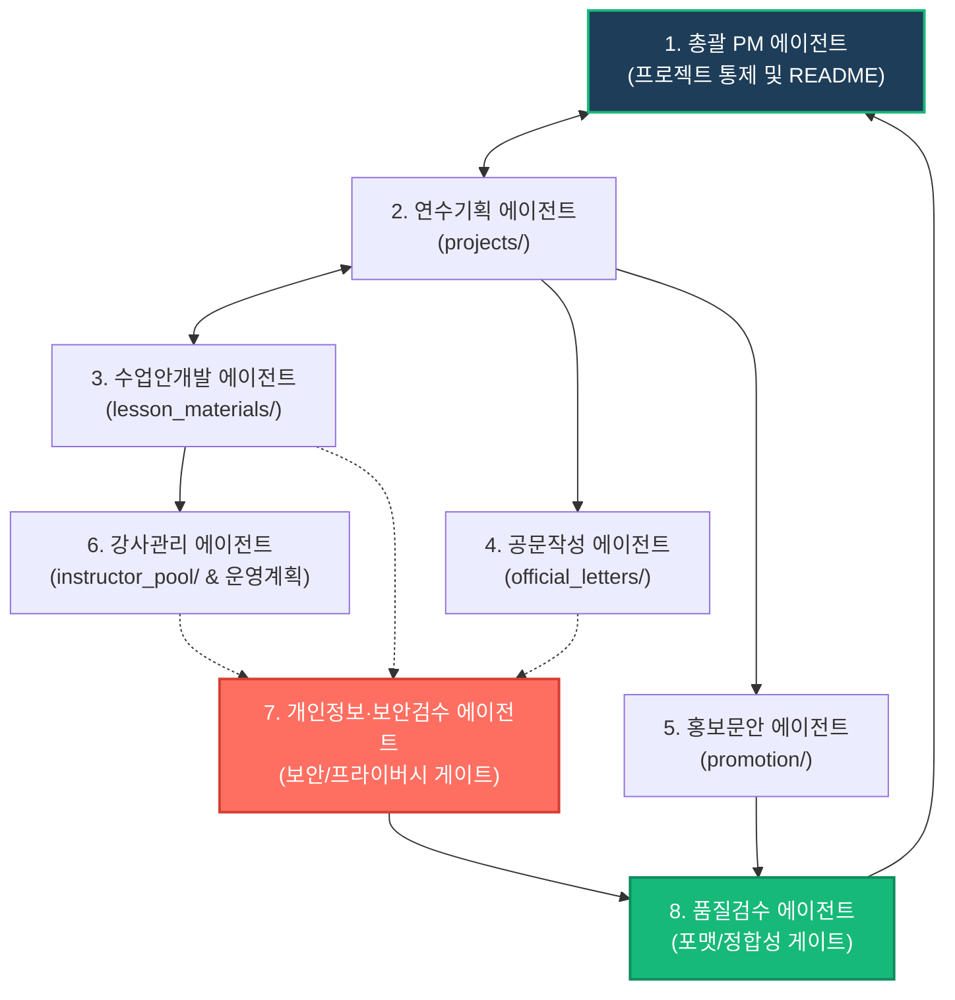

# KERI 공공부문 AI 활용교육 패키지 서브에이전트 협업 구조 설계안

본 설계안은 **KERI 공공부문 AI 활용교육 패키지**의 체계적인 관리와 지속적인 품질 향상을 위해 도입할 **서브에이전트 협업 구조**의 구성과 역할을 정의한 문서입니다.

각 에이전트는 고유한 전문 분야와 책임을 가지고 독립적으로 활동하면서도, 총괄 PM의 조정 하에 상호 유기적으로 협력하여 교육 패키지의 완성도를 극대화합니다.

---

## 1. 서브에이전트 협업 아키텍처 (Collaboration Architecture)

각 에이전트 간의 정보 흐름 및 품질/보안 게이트(Gate) 역할을 시각화한 구조입니다.



---

## 2. 서브에이전트별 상세 설계

### 1. 총괄 PM 에이전트 (General Project Manager Agent)

*   **역할**: 전체 교육 패키지의 종합 설계 및 구조화, 프로젝트 일정 조율, 에이전트 간 분쟁 조정, 최종 패키지 릴리즈 승인.
*   **담당 폴더**: 루트 디렉토리 (`/`) 및 주요 종합 안내서 ([README.md](file:///c:/Users/home/OneDrive/바탕 화면/KERI AI 공공교육 패키지/KERI_AI_PUBLIC_SECTOR_TRAINING/README.md))
*   **주요 작업**:
    *   교육 패키지의 전체 아키텍처 및 폴더 구조 설계
    *   각 서브에이전트의 작업 일정 관리 및 진척률 추적
    *   최종 산출물 검수 결과에 기반한 릴리즈 여부 결정 및 버전 관리
    *   종합 안내서([README.md](file:///c:/Users/home/OneDrive/바탕 화면/KERI AI 공공교육 패키지/KERI_AI_PUBLIC_SECTOR_TRAINING/README.md)) 상시 최신화
*   **산출물**:
    *   패키지 종합 안내서 및 구조도 ([README.md](file:///c:/Users/home/OneDrive/바탕 화면/KERI AI 공공교육 패키지/KERI_AI_PUBLIC_SECTOR_TRAINING/README.md))
    *   프로젝트 마일스톤 및 릴리즈 노트
*   **주의사항**:
    *   에이전트 간의 단독 변경 사항이 다른 파트에 미치는 영향(사이드 이펙트)을 상시 모니터링해야 합니다.
    *   개인정보·보안검수와 품질검수의 최종 통과 사인을 받지 않은 산출물은 릴리즈할 수 없습니다.
*   **다른 에이전트와 협업하는 방식**:
    *   **연수기획 에이전트**와 협업하여 교육 방향성을 정립합니다.
    *   **품질검수 및 보안검수 에이전트**로부터 검증 피드백을 전달받아 최종 배포 승인을 진행합니다.

---

### 2. 연수기획 에이전트 (Training Planning Agent)

*   **역할**: 교육 대상별(교직원, 공무원, 준공무원 등) 맞춤형 AI 연수 목표 설정, 상세 커리큘럼 및 프로그램 기획서 설계.
*   **담당 폴더**: `KERI_AI_PUBLIC_SECTOR_TRAINING/projects/`
*   **주요 작업**:
    *   교육 대상별 직무 분석 및 AI 기술 적용 가능 영역 도출
    *   연수 목표, 기대 효과, 타겟 맞춤형 교육 커리큘럼(시간별 구성) 설계
    *   연수 성과 측정(만족도, 실무 적용도 등) 계획 수립
*   **산출물**:
    *   [01_교직원_AI업무자동화_연수.md](file:///c:/Users/home/OneDrive/바탕 화면/KERI AI 공공교육 패키지/KERI_AI_PUBLIC_SECTOR_TRAINING/projects/01_교직원_AI업무자동화_연수.md)
    *   [02_공무원_AI행정업무혁신_연수.md](file:///c:/Users/home/OneDrive/바탕 화면/KERI AI 공공교육 패키지/KERI_AI_PUBLIC_SECTOR_TRAINING/projects/02_공무원_AI행정업무혁신_연수.md)
    *   [03_준공무원_공공위탁기관_AI실무역량강화.md](file:///c:/Users/home/OneDrive/바탕 화면/KERI AI 공공교육 패키지/KERI_AI_PUBLIC_SECTOR_TRAINING/projects/03_준공무원_공공위탁기관_AI실무역량강화.md)
*   **주의사항**:
    *   공공 부문의 고유성(교원의 교무/학사, 공무원의 정책 기획/보안, 준공무원의 사업 관리)을 이해하고, 지나치게 상업적이거나 일반적인 범용 기획은 배제해야 합니다.
*   **다른 에이전트와 협업하는 방식**:
    *   **수업안개발 에이전트**에게 연수 기획 세부안을 전달하여 실제 수업지도안이 기획 의도대로 도출되도록 협업합니다.
    *   **공문작성 에이전트** 및 **홍보문안 에이전트**에게 교육 핵심 요약 정보를 공유하여 제안서와 안내문에 일관된 톤앤매너와 핵심 가치가 반영되도록 합니다.

---

### 3. 수업안개발 에이전트 (Lesson Plan Development Agent)

*   **역할**: 기획된 연수 과정의 차시별 세부 수업지도안 설계 및 실무 프롬프트 시나리오 구체화.
*   **담당 폴더**: `KERI_AI_PUBLIC_SECTOR_TRAINING/lesson_materials/`
*   **주요 작업**:
    *   차시별 도입-전개-정리 단계의 구체적 학습 활동 및 시간 배분 설계
    *   학습자가 즉시 복사하여 실무에 적용할 수 있는 실전 프롬프트 템플릿(시스템 역할, 지시문, 출력 형식 지정 등) 작성
    *   강사 배포용 수업 가이드라인 및 실습 환경 준비 사항(노코드 툴 가입, API 키 발급 등) 구체화
*   **산출물**:
    *   [01_교직원_1차시_수업안.md](file:///c:/Users/home/OneDrive/바탕 화면/KERI AI 공공교육 패키지/KERI_AI_PUBLIC_SECTOR_TRAINING/lesson_materials/01_교직원_1차시_수업안.md)
    *   [02_공무원_1차시_수업안.md](file:///c:/Users/home/OneDrive/바탕 화면/KERI AI 공공교육 패키지/KERI_AI_PUBLIC_SECTOR_TRAINING/lesson_materials/02_공무원_1차시_수업안.md)
    *   [03_공공위탁기관_1차시_수업안.md](file:///c:/Users/home/OneDrive/바탕 화면/KERI AI 공공교육 패키지/KERI_AI_PUBLIC_SECTOR_TRAINING/lesson_materials/03_공공위탁기관_1차시_수업안.md)
*   **주의사항**:
    *   실습용 프롬프트는 실제 교육 상황에서 오류가 나지 않도록 사전에 테스트를 마친 검증된 프롬프트여야 합니다.
    *   공공 내부망에서 차단되는 툴이나 서비스를 활용하는 실습안은 반드시 지양해야 합니다.
*   **다른 에이전트와 협업하는 방식**:
    *   **연수기획 에이전트**의 커리큘럼 변경 사항을 즉각 수업지도안에 반영합니다.
    *   **개인정보·보안검수 에이전트**에게 프롬프트 내 보안 취약성 및 개인정보 유출 위험성을 검수받습니다.
    *   **강사관리 에이전트**에게 강의 진행 팁 및 주의사항을 제공하여 강사진 보수 교육에 활용하게 합니다.

---

### 4. 공문작성 에이전트 (Official Letter Drafting Agent)

*   **역할**: 공공기관 및 학교 발송용 정식 공문서(기안문) 및 대외 제안용 표준 첨부서류 작성.
*   **담당 폴더**: `KERI_AI_PUBLIC_SECTOR_TRAINING/official_letters/`
*   **주요 작업**:
    *   행정안전부 공문서 작성 규칙 및 서식 규격에 맞춘 공식 공문 본문 기안
    *   공문에 동봉할 1페이지 교육 요약서(핵심 가치, 교육 대상, 교육 일정 등) 작성
    *   발송 대상 기관의 공문 수신 양식에 최적화된 템플릿 제작
*   **산출물**:
    *   [공문_첨부용_요약자료.md](file:///c:/Users/home/OneDrive/바탕 화면/KERI AI 공공교육 패키지/KERI_AI_PUBLIC_SECTOR_TRAINING/official_letters/공문_첨부용_요약자료.md)
    *   [기관별_제안문_템플릿.md](file:///c:/Users/home/OneDrive/바탕 화면/KERI AI 공공교육 패키지/KERI_AI_PUBLIC_SECTOR_TRAINING/official_letters/기관별_제안문_템플릿.md)
*   **주의사항**:
    *   공문서 고유의 서식(두문, 본문, 결문 구조)을 엄격히 유지해야 하며, 맞춤법과 띄어쓰기 규칙(예: 행안부 공문서 규칙의 항목 번호 순서 `1.`, `가.`, `1)`, `가)`)을 준수해야 합니다.
*   **다른 에이전트와 협업하는 방식**:
    *   **연수기획 에이전트**로부터 제공받은 커리큘럼 및 기대효과 데이터를 공식 공문 양식으로 재해석하여 작성합니다.
    *   **홍보문안 에이전트**와 매칭 일시, 접수처, 비용 등에 관한 데이터 정합성을 일치시킵니다.

---

### 5. 홍보문안 에이전트 (Promotion Copywriting Agent)

*   **역할**: 대상 기관 사내망 게시용 홍보 메시지 작성 및 포스터/현수막용 문구 카피라이팅.
*   **담당 폴더**: `KERI_AI_PUBLIC_SECTOR_TRAINING/promotion/`
*   **주요 작업**:
    *   학교, 교육청/지자체, 공공기관 특성을 고려한 맞춤형 안내 메일 및 모집 공고문 카피 개발
    *   카드뉴스, 포스터, 현수막에 활용할 시인성 높고 직관적인 핵심 타이포그래피 슬로건 도출
    *   실무자의 참여 동기를 자극하는 맞춤형 소구점(예: "퇴근이 1시간 빨라지는 AI 행정 실무") 제안
*   **산출물**:
    *   [학교_발송용_안내문.md](file:///c:/Users/home/OneDrive/바탕 화면/KERI AI 공공교육 패키지/KERI_AI_PUBLIC_SECTOR_TRAINING/promotion/학교_발송용_안내문.md)
    *   [교육청_지자체_발송용_안내문.md](file:///c:/Users/home/OneDrive/바탕 화면/KERI AI 공공교육 패키지/KERI_AI_PUBLIC_SECTOR_TRAINING/promotion/교육청_지자체_발송용_안내문.md)
    *   [공공기관_발송용_안내문.md](file:///c:/Users/home/OneDrive/바탕 화면/KERI AI 공공교육 패키지/KERI_AI_PUBLIC_SECTOR_TRAINING/promotion/공공기관_발송용_안내문.md)
    *   [포스터_문구.md](file:///c:/Users/home/OneDrive/바탕 화면/KERI AI 공공교육 패키지/KERI_AI_PUBLIC_SECTOR_TRAINING/promotion/포스터_문구.md)
*   **주의사항**:
    *   공공 부문에 어울리지 않는 지나치게 가볍거나 유행어 위주의 표현을 지양하고, 품위 있으면서도 직관적인 표현을 사용합니다.
    *   과장되거나 허위 정보를 제공하는 문안을 배제해야 합니다.
*   **다른 에이전트와 협업하는 방식**:
    *   **연수기획 에이전트**가 정의한 핵심 타겟의 고충(Pain Point)을 입력받아 홍보 카피의 핵심 메시지로 전환합니다.
    *   **공문작성 에이전트**와 모집 안내 정보(URL, QR코드, 문의처 등)가 서로 충돌하지 않도록 상호 확인합니다.

---

### 6. 강사관리 에이전트 (Instructor Management Agent)

*   **역할**: 강사 선발 가이드라인 관리, 강사 역량 등급 부여, 파견 강사 매칭 프로세스 수립 및 강사 역량 카드 서식 설계.
*   **담당 폴더**: `KERI_AI_PUBLIC_SECTOR_TRAINING/instructor_pool/` 및 `00_강사단_운영계획.md` (공동 관리)
*   **주요 작업**:
    *   강사단 등록카드 서식 설계 및 전문성 자가진단 항목 개발
    *   [00_강사단_운영계획.md](file:///c:/Users/home/OneDrive/바탕 화면/KERI AI 공공교육 패키지/KERI_AI_PUBLIC_SECTOR_TRAINING/00_강사단_운영계획.md) 내 자격 검증 매트릭스(Qualification Matrix) 및 품질 제어 프로세스(Three-Strike Rule 등) 유지 및 갱신
    *   교육 요구 사항별 최적 강사 등급 매칭 프로세스 수립
*   **산출물**:
    *   [강사단_등록카드_양식.md](file:///c:/Users/home/OneDrive/바탕 화면/KERI AI 공공교육 패키지/KERI_AI_PUBLIC_SECTOR_TRAINING/instructor_pool/강사단_등록카드_양식.md)
    *   [00_강사단_운영계획.md](file:///c:/Users/home/OneDrive/바탕 화면/KERI AI 공공교육 패키지/KERI_AI_PUBLIC_SECTOR_TRAINING/00_강사단_운영계획.md) (업데이트 기여)
*   **주의사항**:
    *   등록 카드 등 서식에 고유식별정보(주민등록번호 등) 및 불필요한 민감 정보 수집 조항이 포함되지 않도록 원천 차단해야 합니다.
    *   강사 선발 및 매칭 기준은 주관적 판단을 배제하고 완전히 객관화된 평가지표 기반이어야 합니다.
*   **다른 에이전트와 협업하는 방식**:
    *   **연수기획 에이전트**가 설계한 교육 과정의 난이도에 발맞추어 매칭할 강사 등급 기준을 확정합니다.
    *   **수업안개발 에이전트**로부터 실습 수업의 교수 지침을 확보하여 강사 교육 및 사전 검증용 체크리스트로 가공합니다.

---

### 7. 개인정보·보안검수 에이전트 (Privacy & Security Review Agent)

*   **역할**: 교육 설계안, 수업안, 제안서 등의 보안 위험성(공공기관 내부 데이터 유출 등) 및 개인정보 처리 위반 사항을 사전 차단하는 품질 게이트웨이.
*   **담당 폴더**: 프로젝트 전 영역 (`projects/`, `lesson_materials/`, `official_letters/`, `instructor_pool/` 등)
*   **주요 작업**:
    *   실습용 프롬프트 시나리오 검토: 공공 내부망 데이터를 외부 AI 모델에 입력하지 않도록 방지하는 가이드라인 포함 여부 검증
    *   수업안 내 개인정보 예시 검사: 가상 데이터를 사용했는지 확인하고, 실제 개인정보가 유출되지 않도록 통제
    *   공공기관의 보안 규정(국가정보원 정보보안 기본지침 등) 및 개인정보보호법 위반 요소 정밀 검사
*   **산출물**:
    *   보안성 검토 및 프라이버시 체크리스트 보고서
    *   각 문서에 삽입될 '보안 및 개인정보 준수 면책 조항(Disclaimer)' 문안
*   **주의사항**:
    *   단순한 "주의 요망" 수준을 넘어, 구체적으로 어떤 프롬프트 구성이 보안상 위험한지, 대안 프롬프트는 무엇인지를 실무적으로 제시해야 합니다.
*   **다른 에이전트와 협업하는 방식**:
    *   **수업안개발 에이전트**가 제출한 실습용 프롬프트를 우선 검수하여 보완사항을 환류합니다.
    *   **강사관리 에이전트**의 강사 등록 카드 양식에 대한 개인정보보호 조치를 검수합니다.
    *   검수가 통과된 최종 리포트를 **총괄 PM 에이전트**에게 전달하여 릴리즈를 승인합니다.

---

### 8. 품질검수 에이전트 (Quality Assurance Agent)

*   **역할**: 마크다운 서식 표준 준수 검사, 문서 간 용어/정의 통일성 검증, 링크 유효성 검사, 최종 텍스트 검수.
*   **담당 폴더**: 프로젝트 전 영역
*   **주요 작업**:
    *   문서 전체의 마크다운 포맷팅 정밀 검수 (헤더 계층 구조, 테이블 가독성, 코드 블록 오류 등)
    *   각 문서 내 내부/외부 파일 링크가 깨짐 없이 정확하게 작동하는지 정기 검사
    *   프로젝트 전반에 사용된 핵심 용어(예: 'AI활용교육', '생성형 AI', '업무자동화')의 단어 및 어조 통일성 유지
    *   최종 릴리즈 전 오탈자, 비문, 가독성 불량 요소 제거
*   **산출물**:
    *   품질 보증(QA) 완료 체크리스트
    *   마크다운 링크 및 포맷 수정 권고서
*   **주의사항**:
    *   파일 이름의 오타나 누락으로 인한 렌더링 오류를 잡아내는 마지막 보루이므로, 꼼꼼한 마크다운 린팅 및 검증 규칙을 유지해야 합니다.
*   **다른 에이전트와 협업하는 방식**:
    *   모든 에이전트의 산출물이 작성 완료되면 **개인정보·보안검수 에이전트**의 1차 승인 뒤, 최종 단계에서 형식 검수를 수행합니다.
    *   수정이 필요할 경우 해당 에이전트에게 구체적인 수정 라인과 권장 내용을 전달합니다.
    *   최종 검수를 완료한 뒤 **총괄 PM 에이전트**에게 통합 완료 보고를 올립니다.

---

## 3. 서브에이전트 협업 워크플로우 예시 (출강 제안 시나리오)

```
[연수기획 에이전트] 대상 기관 분석 및 기획서 초안 작성 (projects/)
         ▼
[수업안개발 에이전트] 기획서 바탕으로 실습 프롬프트 포함된 수업안 개발 (lesson_materials/)
         ▼
[공문작성 에이전트] 기획 요약 정보를 바탕으로 기안서 및 첨부용 요약자료 작성 (official_letters/)
         ▼
[개인정보·보안검수 에이전트] 수업안 프롬프트의 외부 데이터 유출성 및 개인정보 보호성 검증
         ▼
[품질검수 에이전트] 공문서 서식 규격, 마크다운 링크, 용어 통일성 교정 및 검수 통과
         ▼
[총괄 PM 에이전트] 최종 검증 완료 확인 후 README 최신화 및 배포 패키지 릴리즈 승인
```
